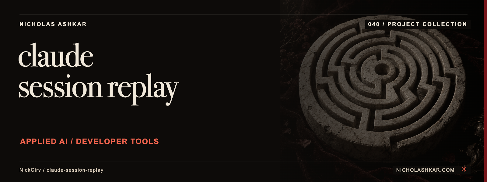

# claude-session-replay

Captures selected local Claude session events and replays them in a terminal or HTML export.


<a id="usage"></a>

<a id="stop-recording-and-save"></a>

<a id="list-recorded-sessions"></a>

<a id="replay-in-terminal"></a>

<a id="export-as-standalone-html"></a>

<a id="delete-a-session"></a>

## What it does

- Record/stop lifecycle.
- Session listing.
- Speed-controlled playback.
- HTML export and deletion.


<a id="install"></a>

<a id="start-recording-run-claude-code-normally-in-another-terminal"></a>

## Quickstart

Prerequisites: Node.js `>=20` and npm. The checkout below pins the source used for this documentation.

```sh
git clone https://github.com/NickCirv/claude-session-replay.git
cd claude-session-replay
git checkout 6d72bfaf7fb9d47613ee25951316859a702d8268
npm install
node bin/replay.js list
```

**Expected behavior (illustrative, not captured):** Lists recorded sessions already stored locally.

Examples are source-inspected, **not runtime-tested**. See the research record for verification gaps.

## Boundaries and data

Recording depends on compatible local JSONL formats and can capture sensitive prompts or tool content. Exports are shareable artifacts; inspect them before sharing. Delete removes saved recordings.

## Development

The manifest defines `npm test` as:

```sh
node --test
```

The captured suite is a smoke check, not end-to-end behavior coverage. Examples include “entry is valid JavaScript”, “--help exits 0”. Tests were not run for this documentation revision.

See [implementation and command reference](docs/REFERENCE.md) for the package scripts and inspected interfaces, and [research record](docs/RESEARCH.md) for the pinned source, document decisions and unresolved checks.

## License and contact

See [LICENSE](LICENSE) for the original terms and attribution. Legal text is unchanged.

[Nicholas Ashkar](https://nicholashkar.com/) · [Discuss a project](https://nicholashkar.com/#oxblood-contact)
